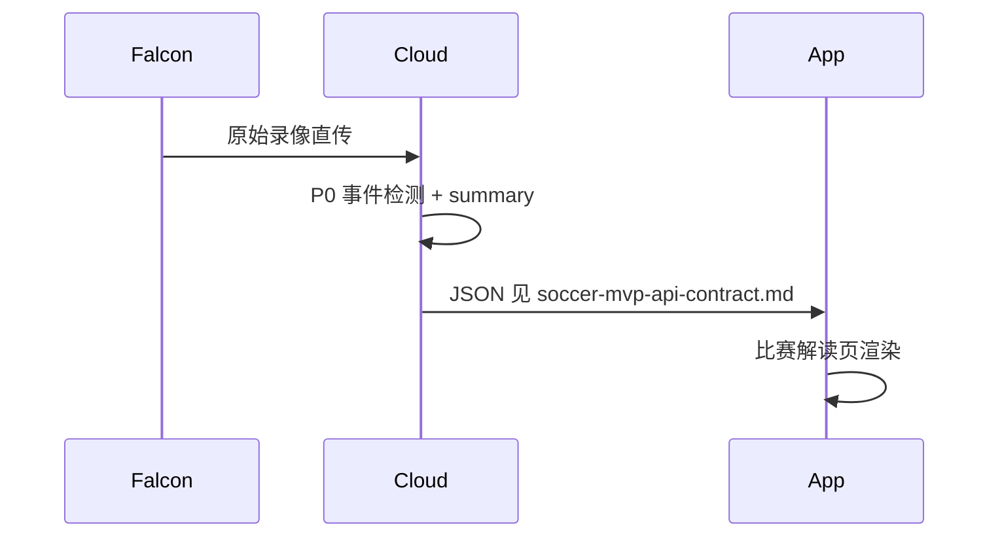

# 足球 MVP：直传云端 + 极简比赛解读

## 1. 产品一句话

先交付 **「终场比分 + 进球/点球时间轴 + 一段话摘要」**，让用户在约 30 秒内知道 **比赛发生了什么**；不做全场战术报告。

## 2. 技术路线（首版默认）

- **默认管线**：`falcon_direct_cloud`（Falcon → 云端，不经 App 重算）。
- **首版不做**：`edge_cloud_hybrid` 端侧先行 + 云端全量的双阶段主路径（仍可在开发者工具中切换做对比，见 [`app.tsx`](../app.tsx) 旁 `TechRouteToggle`）。

## 3. 客户端页面（MVP）

足球 **集锦报告 / 比赛解读**（`HighlightResultScreen` + `resultSport === 'soccer'`）仅保留：

1. 比分条（复用 `SOCCER_MATCH_STATS`）
2. 预览视频位（占位）
3. **云端摘要**（`summary`，与契约一致）
4. **核心事件列表**（仅 `goal`、`penalty`，可点击跳转演示时间）

## 4. v1.1 路线图（明确「不做」以控范围）

| 能力            | 说明                              |
| ------------- | ------------------------------- |
| 角球 / 任意球展示    | 事件类型已有文案键，检测稳定后纳入筛选或时间轴       |
| 端云混合主路径       | 见 [technical-route-edge-cloud-hybrid.md](./technical-route-edge-cloud-hybrid.md) |
| 深度数据表、导出、模板成片 | 归 Pro / 云端高阶，与 MVP 解读页解耦            |

## 5. 相关文档

- [soccer-mvp-api-contract.md](./soccer-mvp-api-contract.md) — JSON 字段与 P0 事件冻结
- [technical-route-edge-cloud-hybrid.md](./technical-route-edge-cloud-hybrid.md) — 混合路线完整矩阵（非 MVP 默认）
