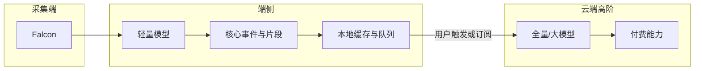

# 第四条技术路线：端侧核心 + 云端全量（高阶付费）

内部 PRD / 技术说明（与预研原型中的 `edge_cloud_hybrid` 管线对应）。

## 1. 与现有三条路线的关系

| 路线 | 行为概要 |
|------|----------|
| `on_device` | 本机处理，无「下载→上传」分步，传输浮层走端侧分析态 |
| `falcon_app_cloud` | Falcon → 本地 App → 云端（三步进度条） |
| `falcon_direct_cloud` | Falcon 直传云端，不经 App（两步：上传/分析） |
| **`edge_cloud_hybrid`** | **两阶段**：端侧先做核心事件/快报 → 再上传云端做全量/高阶分析（可对应付费档） |

第四条路不是替换某一条，而是 **先交付端侧价值闭环，再按需或按订阅触发云端全量**，云侧定位为 **高阶服务（含付费）**。

## 2. 目标架构

## 3. 职责切分

- **端侧（默认/基础）**：近实时检测核心事件（进球、关键回合等），生成时间轴、可播放片段、简易统计；保证首屏可用与弱网/离线下的基础体验。
- **云端（高阶/可选付费）**：对整场或更长窗口做重计算（全量检测、细粒度标签、长期趋势、导出、历史对比等），与产品 Pro/会员能力对齐。

## 4. 数据上云策略（选型）

| 方案 | 内容 | 优点 | 注意 |
|------|------|------|------|
| **A（推荐讨论）** | 上传原始视频 + 端侧事件索引/时间戳 | 云端可对全片重跑大模型，与端侧结果对齐合并展示（可标「云端增强」） | 流量与存储成本 |
| **B** | 上传特征向量 + 关键帧 | 带宽省 | 特征协议版本与兼容性 |
| **C** | 仅在高阶开通或 Wi‑Fi + 插电等条件下传全量 | 成本与体验平衡 | 需清晰的产品规则 |

## 5. 产品表述与差异

- 用户先看到 **端侧快报**；可提供「生成完整报告（云端）」「解锁全量分析」等入口，进入队列与计费（订阅或按次）。
- 与 **`on_device`**：第四条 **设计上会上云** 完成全量/高阶，而非永久仅端侧。
- 与 **`falcon_app_cloud` / `falcon_direct_cloud`**：第四条 **先完成端侧核心再异步触发云端全量**，而非单一路径只等云端一次性结果。

## 6. 付费边界（示例）

- **基础含**：端侧核心事件时间轴、基础片段、本地回看。
- **高阶/付费**：全量重分析、高分辨率导出、深度数据面板、跨场次对比、优先队列等（与 Pro 矩阵对齐）。

## 7. 任务与状态机（实现要点）

- 子任务：`edge_job`（必跑）→ `cloud_full_job`（可选/付费，原型中与上传后云端分析阶段对应）。
- 原型 UI：传输浮层为 **两段式分析**：先端侧处理，再上传 + 云端分析；云端段可与会员门控、蜂窝提醒等现有模式组合。

## 8. 命名建议

- 中文：**端侧优先 · 云端全量（高阶）**
- 英文：**Edge-first, cloud full analysis (premium)**

## 9. 端云能力矩阵（产品与技术对齐）

| 能力 | 端侧（核心/快报） | 云端（全量/高阶） |
|------|-------------------|-------------------|
| 事件检测 | 稀疏：进球/关键得分、少量高置信片段 | 全场重跑、补漏、细粒度战术与球员标签 |
| 时间轴 / 列表 | 粗时间轴、可跳转锚点 | 稠密时间线、全类型筛选一致 |
| 数据面板 | 核心对比行（如进球/射门/角球） | 完整对比、控球与深度可视化等 |
| **自动成片 / 模板** | 不提供（仅提示上云后可用） | **多模板合成、Pro 档位、叙事与转码** |
| 导出 / 合并 | 限制（引导先上云） | 报告导出、成片分享、高清无水印等 |
| 跟练 / Pro 课包 | 随稀疏事件可极少展示 | 与全量复盘、订阅矩阵对齐 |

原型中：`galleryHybridDemoView === 'edge_result'` 时使用 **裁剪后的片段列表与对比行**；云端预览与正式全量路径下恢复 **全量 `clips` + 成片入口**。

## 10. 原型实现要点（与代码同步）

- [`app.tsx`](app.tsx)：`filterClipsForHybridEdgeTier` 在端侧演示时过滤片段；`tierStatsData` 缩小对比表行集。
- 端侧态下 **成片 CTA、快捷模板横滑区隐藏**，替换为说明卡片；导出/合并/模板合成入口 **toast 拦截**。
- 赛果卡顶部横幅与「上云全量分析」按钮保留，用于切换 `cloud_result` 预览态。

